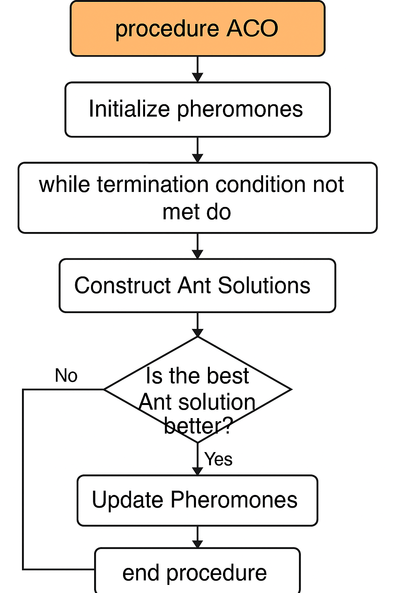

---

## 📝 `steps.md`

# ACO Algorithm Steps

## Overview
Ant Colony Optimization (ACO) mimics ants' pheromone-based pathfinding behavior to solve combinatorial optimization problems like TSP.

## Pseudocode
```plaintext
# Ant Colony Optimization for Traveling Salesman Problem (TSP)
# Pseudocode for ACO_TSP
# This algorithm finds the shortest path visiting all cities exactly once.
# and returning to the starting city.

---
Algorithm ACO_TSP
Input: number of cities N, distance matrix D[N][N], number of ants M, 
       alpha, beta, evaporation rate, number of iterations

Output: Best tour and its total length

1. Initialize pheromone matrix P[N][N] with a small positive value
2. For iteration = 1 to number of iterations do:
    a. For each ant k = 1 to M do:
        i. Place ant k on a randomly selected city
        ii. For step = 1 to N-1 do:
            - Calculate probability of moving to next city based on:
                Pheromone strength (alpha) and Heuristic information (1/distance) (beta)
            - Move to selected next city
        iii. Complete the tour by returning to start city
        iv. Compute length of tour
    b. Update pheromones:
        i. Evaporate pheromone on all paths: P[i][j] = (1 - evaporation_rate) * P[i][j]
        ii. For each ant, deposit pheromone on its tour:
            P[i][j] += Q / tour_length (for each edge in the tour)
    c. Track the best solution found so far
3. Return the best tour and its length

```
---

## Mathematical Basis
- **Transition Probability**: 
  $P_{ij}^k = \frac{[\tau_{ij}]^\alpha \cdot [\eta_{ij}]^\beta}{\sum_{l \in \text{allowed}} [\tau_{il}]^\alpha \cdot [\eta_{il}]^\beta}$
- **Pheromone Update**: 
  $ \tau_{ij} \leftarrow (1 - \rho)\tau_{ij} + \sum_k \frac{Q}{L_k} $

## Comparison with Other Paradigms
| Paradigm | Strengths | Weaknesses | Relation to ACO |
|---------|-----------|------------|------------------|
| Brute Force | Exact solution | Exponential time | Infeasible for large N |
| Greedy | Fast | Poor quality | ACO improves via learning |
| Genetic Algorithms | Global search | Premature convergence | Similar metaheuristic approach |

## Flowchart



---