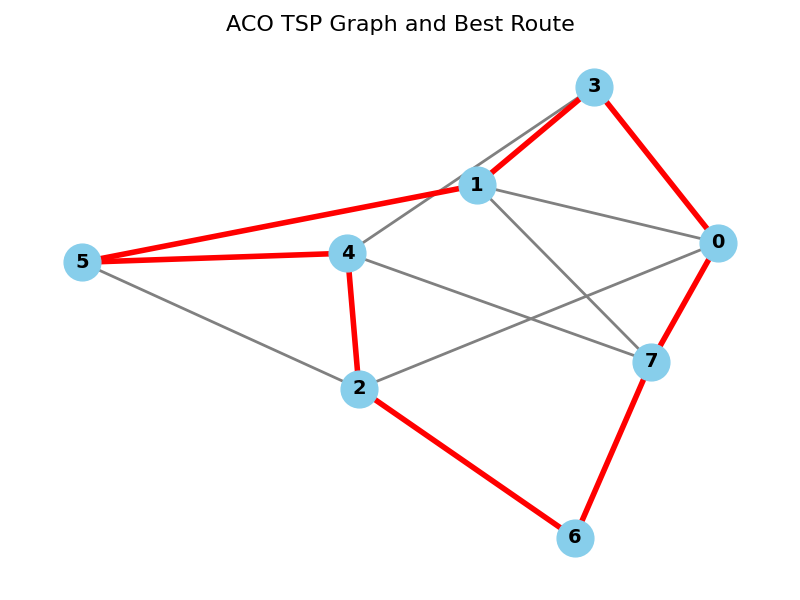
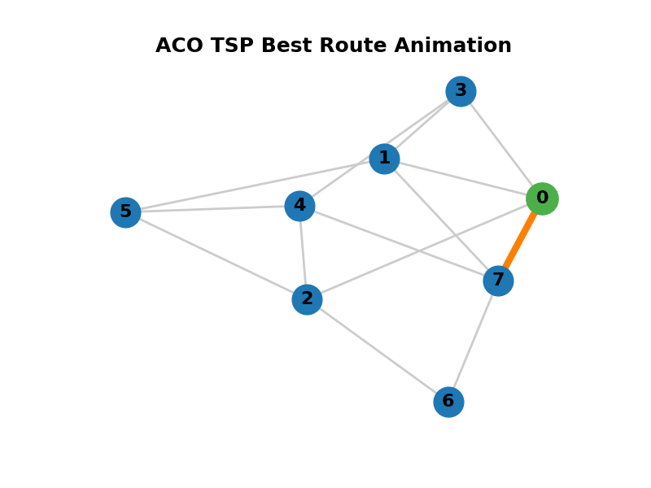

# Ant Colony Optimization (ACO) for the Traveling Salesman Problem

This project implements the Ant Colony Optimization (ACO) algorithm to solve the classic Traveling Salesman Problem (TSP). The ACO algorithm is inspired by the foraging behavior of real ants and uses artificial pheromone trails to probabilistically guide a colony of agents (ants) toward optimal or near-optimal solutions.

---

## Features

- **Customizable number of ants and cities**
- **Configurable ACO parameters** (alpha, beta, Q, evaporation rate, etc.)
- **Randomized initial pheromone trails**
- **Euclidean distance calculation based on city coordinates**
- **Graph and pheromone matrix visualization**
- **Iterative optimization with pheromone updates**
- **Displays best route and its length after optimization**

---

## File Structure

```
src/
├── main.cpp        # Entry point: sets up and runs the ACO algorithm
├── ACO.h           # Declaration of the ACO class and its methods
├── ACO.cpp         # Implementation of the ACO class
├── Randoms.h       # Declaration of the Randoms class (random number utilities)
├── Randoms.cpp     # Implementation of the Randoms class
```

---

## How It Works

1. **Initialization:**  
   The program sets up a graph of cities, initializes pheromone trails, and assigns coordinates to each city.

2. **Optimization Loop:**  
   For a specified number of iterations, each ant constructs a route through all cities, guided by pheromone strength and heuristic information (distance). After all ants complete their routes, pheromone trails are updated to reinforce shorter (better) routes.

3. **Result:**  
   After all iterations, the program prints the best route found and its total length.

---

## Getting Started

### Prerequisites

- **C++ Compiler:**
    - [g++ (MinGW or MSYS2)](https://www.msys2.org/) on Windows
    - Or any modern C++ compiler (supporting C++11 or later)

### Build Instructions

1. **Clone or Download the Repository**

2. **Open a terminal and navigate to the `src` directory:**
   ```sh
   cd path/to/aco-master/src
   ```

3. **Compile the project:**
   ```sh
   g++ -o aco.exe main.cpp ACO.cpp Randoms.cpp
   ```

4. **Run the executable:**
   ```sh
   ./aco.exe
   ```

---

## Configuration

You can adjust the following parameters in `main.cpp`:

```cpp
#define ITERATIONS      5       // Number of optimization iterations
#define NUMBEROFANTS    4       // Number of ants in the colony
#define NUMBEROFCITIES  8       // Number of cities (nodes)
#define ALPHA           0.5     // Influence of pheromone
#define BETA            0.8     // Influence of heuristic (distance)
#define Q               80      // Pheromone deposit factor
#define RO              0.2     // Pheromone evaporation rate
#define TAUMAX          2       // Maximum initial pheromone
#define INITIALCITY     0       // Starting city for all ants
```

You can also modify the graph structure and city coordinates in `main.cpp` to experiment with different TSP instances.

---

## Example Output

```
GRAPH:
  | 0 1 2 3 4 5 6 7
- | - - - - - - - -
0 | x 1 1 1 0 0 0 1
...
PHEROMONES:
  |     0       1       2       3 ...
- | ---------------------------------
0 |     x     0.103   1.624   0.245 ...
...
ITERATION 1 HAS STARTED!
: ant 0 has been released!
...
BEST ROUTE:
0 7 6 2 4 5 1 3
length: 127.509
```

---

### Ant Colony Optimization (ACO) Complexity Table

| Step/Operation                  | Time Complexity         | Space Complexity        | Notes                                                      |
|----------------------------------|------------------------|------------------------|------------------------------------------------------------|
| Initialization (graph, arrays)   | O(n²)                  | O(n² + m·n)            | Graph, pheromones, routes, etc.                            |
| Route construction (per ant)     | O(n²)                  | O(n)                   | Each ant builds a route by evaluating all possible moves   |
| Route construction (all ants)    | O(m·n²)                | O(m·n)                 | All ants in one iteration                                  |
| Pheromone update (per iteration) | O(n²)                  | O(n²)                  | Update pheromones for all edges                            |
| Best route update                | O(m·n)                 | O(n)                   | Compare all ants' routes                                   |
| **Total per iteration**          | O(m·n²)                | O(n² + m·n)            | Dominated by route construction and pheromone update       |
| **Total for k iterations**       | O(k·m·n²)              | O(n² + m·n)            | Main overall complexity                                    |

**Legend:**
- n = number of cities
- m = number of ants
- k = number of iterations

---

## Benchmark Graph
### **OF src/main.cpp file**


---

## Animating Graph
### **OF src/main.cpp file**


---

## References

- Dorigo, M., & Gambardella, L. M. (1997). [Ant Colony System: A Cooperative Learning Approach to the Traveling Salesman Problem](https://ieeexplore.ieee.org/document/585892). IEEE Transactions on Evolutionary Computation.
- [Wikipedia: Ant Colony Optimization Algorithms](https://en.wikipedia.org/wiki/Ant_colony_optimization_algorithms)


---

## Acknowledgements

- This implementation is for educational and research purposes.
- Special thanks to the open-source community for algorithmic inspiration and resources.
